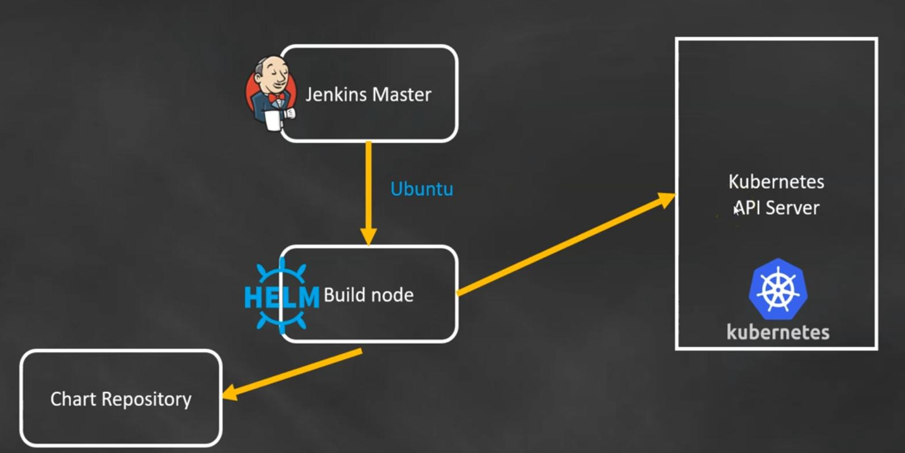

# Section 11 - Helm Charts



- Package manager for Kubernetes
- A **`Chart`** is package of pre-configured Kubernetes resources
- A **`Repository`** is a group of published charts which can be made available to others
- Helm is used for **`repetitive`** tasks and applications
- Helm should be installed on the Jenkins slave (build server)

## Installing Helm and how it works

Install `Helm`:
```bash
curl -fsSL -o get_helm.sh https://raw.githubusercontent.com/helm/helm/master/scripts/get-helm-3
chmod 700 get_helm.sh
./get_helm.sh
```

Validate helm installation
```bash
helm version
helm list
```

[optional] Download .kube/config file to build the node
```bash
aws eks update-kubeconfig --region us-east-1 --name jw-eks-01
```

Setup helm repo
```bash
helm repo list
helm repo add stable https://charts.helm.sh/stable
helm repo update
helm search repo <helm-chart>
helm search repo stable
```

Install mysql charts on Kubernetes
```bash
helm install demo-mysql stable/mysql
```

To pull the package from the repo
```bash
helm pull stable/mysql
```

Once you have pulled the helm chart, you will see a zip file. Have a look in it:
```txt
mysql/Chart.yaml
mysql/values.yaml
mysql/templates/NOTES.txt
mysql/templates/_helpers.tpl
mysql/templates/configurationFiles-configmap.yaml
mysql/templates/deployment.yaml
mysql/templates/initializationFiles-configmap.yaml
mysql/templates/pvc.yaml
mysql/templates/secrets.yaml
mysql/templates/serviceaccount.yaml
mysql/templates/servicemonitor.yaml
mysql/templates/svc.yaml
mysql/templates/tests/test-configmap.yaml
mysql/templates/tests/test.yaml
mysql/.helmignore
mysql/README.md
```
The main contents here are:
- **Chart.yaml**
  - Information about the helm-chart
- **values.yaml**
  - Can provide values for a helm-chart to use
- **templates**
  - Contains different kubernetes manifests files
- **README.md**
  - How you can use the helm-chart

Now make some changes to the local version of the mysql chart:
- Change the version in the `Chart.yaml` to 1.7.0
- In the `values.yaml` change `ClusterIP` to `NodePort` and uncomment `nodePort: 32000`

Now install the new version of the helm-chart under a new name:
```bash
# No "stable/" before mysql => will use the local `mysql` folder with the changes
helm install demo-2-mysql mysql
# Look at the new deployed mysql chart
helm list
```

To remove the deployed charts again you have to use the following command:
```bash
helm uninstall demo-mysql
helm uninstall demo-2-mysql
```

## Creating and deploying your own custom Helm chart
- Create your own Helm chart (creates all required files for helm chart)
  ```bash
  helm create ttrend
  ```
- Replace all files in `templates`-directory with the kubernetes manifest files that were previously used
  ```bash
  cd ttrend/templates
  rm -rf *
  cp ~/kubernetes/*.yaml .
  ```
- Check for anything running
  ```bash
  helm list              # checks for any helm deployment
  kubectl get all -n jw  # checks for any kubernetes deployment in jw namespace (from before)
  ```
- Go to the home-directory of the build-server (where `ttrend` is located) and "install" it
  ```bash
  cd $HOME
  helm install ttrend-v1 ttrend

  # See if it is deployed
  helm list
  ```
- Check with `kubectl` for the deployed services
  ```bash
  kubectl get all           # should be only showing service/kubernetes
  kubectl get all -n jw     # should show the deployed helm chart of ttrend
  ```

The next step is again, to use Jenkins to deploy a helm chart instead of doing it manually.


## Deploying Helm charts with Jenkins
- Stop the prev. deployment and package the :
  ```bash
  helm uninstall ttrend-v1
  helm list  # verify that ttrend-v1 is removed
  helm package ttrend
  ```
- Download (e.g. with `scp`) the tgz-archive and push it to github (accessible to Jenkins)
  ```bash
  # in the tweet-trend folder
  scp -i /path/to/key.pem ubuntu@<build-server-ip>:/home/ubuntu/ttrend-0.1.0.tgz .
  ```
- Update Jenkinsfile by removing the previous deploy stage and replacing it with this
  ```groovy
  stage("Deploy")
  {
      steps 
      {
          script 
          {
              echo '<--------------- Helm Deploy Started --------------->'
              sh 'helm install ttrend ttrend-1.0.1.tgz'
              echo '<--------------- Helm deploy Ends --------------->'
          }
      }
  } 
  ```
- Push the archive and the Jenkinsfile to github and let Jenkins do the rest