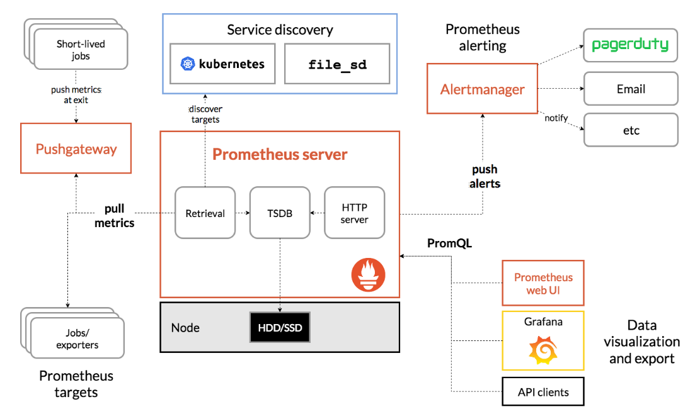

# Section 12 - Prometheus and Grafana

- Prometheus and Grafana will be used to monitor the deployed kubernetes cluster

## Prometheus introduction

Link: https://prometheus.io/docs/introduction/overview/

- Prometheus is open source system-monitoring and alterting toolkit
- Collects and stores metrics as time series data
- Scrapes targets
- PromQL is languate to query time series data in Prometheus
- Service discovery helps find our services and monitor them
- Exporters help to monitor 3rd party components
- Can send alaerts to Alert-manager
- Prometheus runs on port 9090 and Alert-manager on port 9093



## Prometheus-Grafana Stack Setup

**Pre-requisites**:
- Kubernetes cluster
- Helm

### Prometheus
1. Create monitoring namespace for Prometheus
   ```bash
   kubectl create namespace monitoring
   ```
2. Add Prometheus Helm-charts repository
   ```bash
   helm repo add prometheus-community https://prometheus-community.github.io/helm-charts
   ```
3. Update the Helm-charts repository
   ```bash
   helm repo update
   helm repo list
   # Output:
   #   NAME                    URL                                               
   #   stable                  https://charts.helm.sh/stable                     
   #   prometheus-community    https://prometheus-community.github.io/helm-charts
   ```
4. Install Prometheus with Helm
   ```bash
   # Get the archive (to look into)
   helm pull prometheus-community/kube-prometheus-stack
   # Install it the regular way
   helm install prometheus prometheus-community/kube-prometheus-stack --namespace=monitoring
   # List all resources of the helm-chart
   kubectl get all -n monitoring
   ```
5. The previous command creates services as ClusterIP. To access Prometheus out side of the cluster, we should change the service type load balancer
   ```bash
   # Change the service type from `ClusterIP` to `LoadBalancer`
   kubectl edit svc prometheus-kube-prometheus-prometheus -n monitoring
   ```
6. Access the Prometheus dashboard with https://ELB:9090
   - ELB is the DNS name of the load balancer which can be found in the AWS ui or as the `EXTERNAL-IP` of `service/prometheus-kube-prometheus-prometheus`
  
7. Check for `node_load15` executor to check cluster monitoring

### Grafana
- Is multi-platform open-source and analytics and interactive visualization web application
- Provides charts, graphs and alerts for the web, when connected to supported data services
- Allows to query, visualize, alert and understand our metrics, no matter where they are stored
  - Some supporteddata sources in addition to Prometheus are AWS CloudWatch, AzureMonitor, PostgreSQL, Elasticsearch and many more.
- You can create your own dashboard or use existing ones provided by Grafana. You can personalize per your requirements.

8. Change the `type` from `ClusterIP` to `LoadBalancer`
   ```bash
   kubectl edit svc prometheus-grafana -n monitoring
   ```
