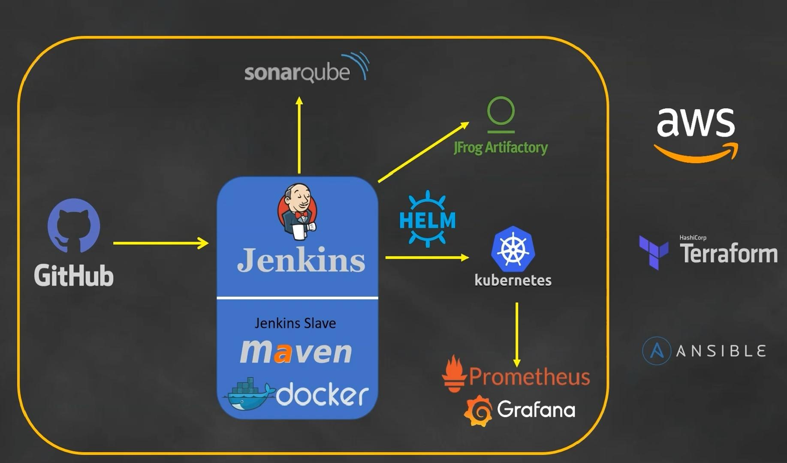

# Section 1 - Introduction

## Introduction

- CI/CD Pipeline
- Git for source code
- Building code with jenkins
- Jenkins Master-Slave configuration
- Sonarcube for analysis
- Artifacts put to JFrog Artifactory
- Docker image also saved to Artifactory
- Deploying on Kubernetes with the help oif Helm
- Kubernetes monitored with prometheus and Grafana
- Resource provision with Terraform
- Config.-management with Ansible
- Deployment on AWS

## Topics
1. Setup Terraform
2. Provision Jenkins master, build node, and Ansible using Terraform
3. Setup Ansible server
4. Configure Jenkins master and build node using Ansible
5. Create Jenkins pipeline job
6. Create Jenkinsfile from scratch
7. Create multibranch pipeline
8. Enable webhook on GitHub
9. Configure SonarQube and Sonar scanner
10. Execute the Sonar analysis
11. Define rules and gates of SonarQube
12. Sonar callback rules
13. Jfrog Artifactory setup
14. Create Dockerfile
15. Store Docker images on Artifactory
16. Provision Kubernetes cluster using Terraform
17. Create Kubernetes objects
18. Deploy the Kubernetes objects using Helm
19. Setup Prometheus and Grafana using Helm charts
20. Monitor Kubernetes cluster using Prometheus