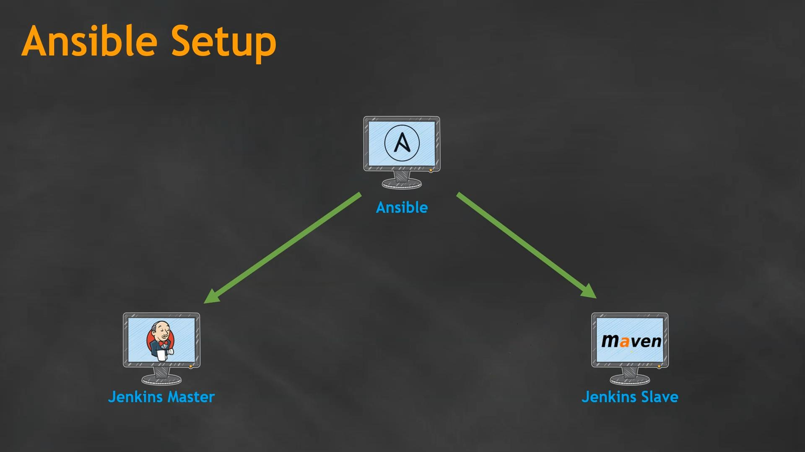

# Section 4 - Ansible for DevOps



- Requires the 3 EC2-instanced that were created with Terraform
- One of the instances is Ansible
- The Ansible server manages 2 services (Jenkins & Maven) with Ansible Playbooks

## Setup Ansible

1. Install Ansible
2. Add inventory (file)
3. Copy private key on to Ansible
4. Test connection

### Login to Instance and Installation of Ansible
Get the public IPv4 address of the `ansible` ec2-instance and connect to it with this:
```bash
ssh -i /path/to/key.pem ubuntu@<ansible-ipv4>
```

Install Ansible on Ubuntu 22.04 / Ubuntu 24.04
```bash
sudo apt update
sudo apt install software-properties-common
sudo add-apt-repository --yes --update ppa:ansible/ansible
sudo apt install ansible
```

Check if you have ansible installed
```bash
ansible --version
```

### Adding managed Maven and Jenkins Node to Ansible
- Adding Jenkins (Master) and Maven (Slave)
- Go to `/opt` on the Ansible instance and create a `hosts`-file
```bash
sudo su - # for writing permissions in `/opt`
touch hosts
```

Examplary conent:
```
[Jenkins-master]
18.209.18.194
[jenkins-master:vars]
ansible_user=ec2-user
ansible_ssh_private_key_file=/opt/ddp.pem
[build-slave]
54.224.107.148
[build-slave:vars]
ansible_user=ec2-user
ansible_ssh_private_key_file=/opt/ddp.pem
```
- Here the **private IPv4 addresses are used**, since they dont change every time the instance is created
- Copying the keys for interaction to the ansible instance with `scp`
  ```bash
  # On local machine
  scp -i /path/to/key.pem /path/to/key.pem ubuntu@<ansible-ec2-ip>:~/
  # On EC2 instance
  sudo mv ~/ddp.pem /opt/
  sudo chmod 400 /opt/ddp.pem
  ```

Now you can test the connection
```bash
root@ansible:/opt# ansible all -i hosts -m ping 
```

And you get these results:
```log
[WARNING]: Invalid characters were found in group names but not replaced, use -vvvv
to see details
The authenticity of host '10.1.1.210 (10.1.1.210)' can't be established.
ED25519 key fingerprint is SHA256:zcuTj74q/whtLn+kNqLbgkryV9qXSfiGKA+Kfj4ReUA.
This key is not known by any other names.
Are you sure you want to continue connecting (yes/no/[fingerprint])? yes
10.1.1.210 | SUCCESS => {
    "ansible_facts": {
        "discovered_interpreter_python": "/usr/bin/python3"
    },
    "changed": false,
    "ping": "pong"
}
```

## Writing Ansible playbook to install Jenkins


- Before installing jenkins with a ansible playbook you install jenkins manually
- After manually installing jenkins it should be easier to understand how playbooks work

### (Manual) Jenkins Installation

1. Add Jenkins repo keys to system
2. Add repository to system
3. Install dependencies
4. Install Jenkins

Install instructions for debian based linux: https://pkg.origin.jenkins.io/debian-stable/
- Ansible documetnation `apt_key`: https://docs.ansible.com/ansible/latest/collections/ansible/builtin/apt_key_module.html
- Documentation `apt_repoistory`:  https://docs.ansible.com/ansible/latest/collections/ansible/builtin/apt_repository_module.html

The `jenkins-master-setup.yaml` playbook file:
```yml
---
- hosts: jenkins-master  # executed from here
  become: true           # root user (yes/no)
  tasks:
  # 1. Add Jenkins repo keys to system
  - name: add jenkins key
    apt_key:
      url: https://pkg.jenkins.io/debian-stable/jenkins.io-2023.key
      state: present
    
  # 2. Add repository to system
  - name: add jenkins repository
    repo: 'deb https://pkg.jenkins.io/debian-stable binary/'
    state: present

  # 3. Install dependencies
  - name: install java
    apt:
      name: openjdk-17-jre
      state: present

  # 4. Install Jenkins
  - name: install jenkins
    apt:
      name: jenkins
      state: present
 
  - name: start jenkins service
    service:
      name: jenkins
      state: started

  - name: enable jenkins to start at boot time
    service:
     name: jenkins
     enabled: yes
```

### Run the Ansible playbook to install jenkins

Copy `jenkins-master-setup.yaml` to the ansible instance with
```bash
# On local computer (copy to server)
scp -i /path/to/key.ppm jenkins-master-setup.yaml ubuntu@<ansible-ipv4>:~/

# On ansible server (copy to opt-directory)
sudo su -
mv jenkins-master-setup.yaml /opt
```

Check the file with a dry-run:
```bash
ansible-playbook -i /opt/hosts jenkins-master-setup.yaml --check
```

This will result in an error, since jenkins is not yet installed. To run the playbook and install everything specified in it, you have to use this:
```bash
ansible-playbook -i /opt/hosts jenkins-master-setup.yaml
```

Jenkins is now running but not yet accessible over the ip of the `jenkins-master` and port `8080`. This is because of the security group of the vpc currently only has port 22 open. To automate this, the terraform file has to be changed to allow access to port `8080`.

To allow access to port `8080` the follwoing `ingress`-rule has to be added to the terraform file, that is used to provision the 3 instances:
```bash
ingress {
    description = "Jenkins access"
    from_port   = 8080
    to_port     = 8080
    protocol    = "tcp"
    cidr_blocks = ["0.0.0.0/0"]
}
```

The result can be seen here:


- Now open the `jenkins-master`-IP in the browser with port `8080` and to get to the Jenkins GUI.
- Get the login-password from here (while root): `cat /var/lib/jenkins/secrets/initialAdminPassword`
- Choose `Install suggested plugins`
- For now choose `Skip and continue as admin` to proceed as admin user
- Instance Configuration: `Not now`
- Click `Start using Jenkins`


## Ansible Playbook for installing Maven on Jenkins-Slave


1. Update the system
2. Insall Java
3. Download Maven packages
4. Extract Mavan packages
5. Add path to `.bash_profile` (Optional)


```yaml
---
- hosts: build-slave
  become: true
  tasks:
  # 1. Update the system
  - name: updata ubuntu repo and cache
    apt:
      update_cache: yes
      force_apt_get: yes
      cache_valid_time: 3600
    
  # 2. Insall Java
  - name: install java
    apt:
      name: openjdk-17-jre
      state: present

  # 3. Download Maven packages
  - name: download maven packages
    get_url:
      url: https://dlcdn.apache.org/maven/maven-3/3.9.9/binaries/apache-maven-3.9.9-bin.tar.gz
      dest: /opt
  
  # 4. Extract Mavan packages
  - name: extract maven packages
    unarchive:
      src: /opt/apache-maven-3.9.9-bin.tar.gz
      dest: /opt
      remote_src: yes
```

### Setting up maven 
- Connect to ansible server via ssh and place the `jenkins-slave-setup.yaml` playbook into `/opt`
- Run `ansible-playbook -i /opt/hosts jenkins-slave-setup.yaml` to install maven
- Connect to the `build-slave` via *ssh* and check if java and maven are installed