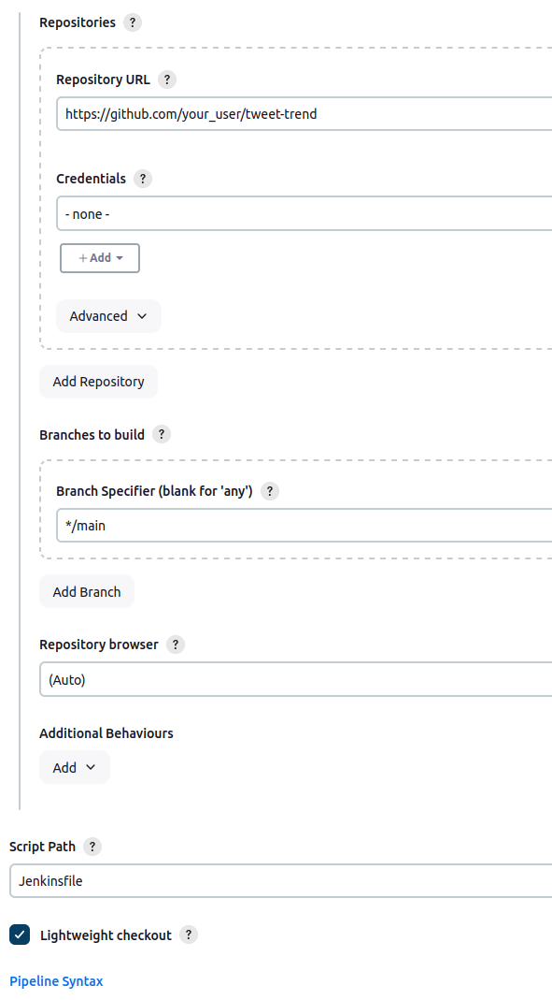

# Section 5 - Jenkins

- Using Jenkins as Continuous Integration (CI) tool

## Jenkins Master and Slave Setup

1. Add credentials
2. Add node

### Add credentials
- Open jenkins in the browser
- Select `[Dashboard]` -> `[Manage Jenkins]` -> `[Credentials]` -> `[Global credentials]` -> `[Add credentials]`
- **New credentials**
  - **Kind**: `SSH Username with private key`
  - **Scope**: `Global`
  - **ID**: `maven-server-cred`
  - **Description**: `maven server credentials`
  - **Username**: `ubuntu`
  - **Private key**: <prev. used pem-key>

### Add Maven Server as Jenkins slave
- Go to `[Dashboard]` -> `[Manage Jenkins]` -> `[Nodes]` -> `[New Node]`
- **New node**:
  - **Node name**: maven-slave
  - **Type**: Permanent Agent

Use this information to configure the node:
- **Number of executors**: 3
- **Remote root directory**: /home/ubuntu/jenkins
- **Labels**: maven
- **Usage**: Use this node as much as possible
- **Launch method**: Launch agents via SSH
- **Host**: <Private_IP_of_Slave>
- **Credentials**: <Jenkins_Slave_Credentials>
- **Host Key Verification Strategy**: Non verifying Verification Strategy
- **Availability**: Keep this agent online as much as possible

### Create simple job
- Go to `[Dashboard]` -> `[All]` -> `[New Item]`
- **New Item**:
  - **Name**: test-job
  - **Item type**: Freestyle project

- **General**:
  - **Restrict where this project can be run** -> Label expression -> maven
  - **Build Steps** ->  Execute shell
    ```bash
    echo "Hello, I am slave system" >> /home/ubuntu/maven.txt
    ```

## Create first Jenkins pipeline job

- Go to `[Dashboard]` -> `[New Item]`
- **Item name**: ttrend-job
- **Type**: Pipeline
- **Pipeline**:
  - Definition: Pipeline script
  - Script:
    ```groovy
    pipeline {
        agent {
            node {
                label "maven"
            }
        }
        stages {
            stage('Clone-code') {
                steps {
                    git branch: 'main', url: 'https://github.com/joweyel/tweet-trend'
                }
            }
        }
    }
    ```

This will clone the specified git repo to the slave-instance,


## Write your 1st Jenkinsfile
Usually the pipeline is not written in the job itself but read from a jenkinsfile. This makes the pipeline easier to reproduce, since it only has to load a file.

- Fork the repo: https://github.com/ravdy/tweet-trend
- Clone the repo and add `Jenkinsfile`
  ```groovy
  pipeline {
        agent {
            node {
                label "maven"
            }
        }

        stages {
            stage('Clone-code') {
                steps {
                    git branch: 'main', url: 'https://github.com/joweyel/tweet-trend'
                }
            }
        }
    }
  ```

Now configure the job according to this:



- Save and execute the the job
- The job currently clones the repository two times, insterad building is the way to go
- Pipeline must be told where to find maven binary

```groovy
pipeline {
    agent {
        node {
            label "maven"
        }
    }
    environment {
        PATH = "/opt/apache-maven-3.9.9/bin:$PATH"
    }

    stages {
        stage('Clone-code') {
            steps {
                sh 'mvn clean deploy'
            }
        }
    }
}
```

- Run the job again. No need to change anythin in Jenkins.

## Adding GitHub credentials to Jenkins
Generate a `Personal access tokens (classic)` in Github in the settings [here](https://github.com/settings/tokens) and name it `jenkins-token`

Set the parameters as follows:
- Expiration: 30 days
- Check ALL privileges
- Obtain the git token
  
In Jenkins GUI
- `[Dashboard]` -> `[Manage Jenkins]` -> `[Credentials]` -> `[System]` -> `[Global credentials]` -> `[Add credentials]`
- **Add New credentials**
  - **Kind**: Username with password
  - **Scope**: Global
  - **Username**: <your_git_username>
  - **Password**: <git_token>
  - **ID**: Github_Cred
  
- Got to `ttrend-job` and then `[Configure]`
- Now you can use the git token as credentials for SCM

## Setup a multibranch pipeline job

- Go to `[Dashboard]` -> `[New Item]`
- Use name `ttrend-multibranch`
- Under `Branch Sources` select git and configure the repo
- This only finds one branch (since there is only `main`)
- Create new branch `dev` s.t. there are two branches
- Now click `Scan Multibranch Pieline Now` to re-run the process and see that now 2 branches were used

**There is still a big problem**: everything has to be executed manually. 
- The pipeline-run should be triggered at certain events (after code changes)

## Github Webhooks

- Can trigger the run of a job at specific github events
- For exectuting the multibranch pipeline job
  - Go to `[Dashboard]` -> `[Manage Jenkins]` -> `[Plugins]` -> `[Available plugins]`
  - Search and install `Multibranch Scan Webhook Trigger`
- Go to `[Dashboard]` an open your multibranch pipeline job
- Click on `[Configuration]` -> `[Scan Multibranch Pipeline Triggers]`, then check `[Scan by webhook]` and provide a token (lates used for invoking build process)
- Create the url `http://JENKINS_URL:8080/multibranch-webhook-trigger/invoke?token=[Trigger token]` by inserting the ip the jenkins server is using and the token you just have set
- Go to settings of your forked `tweet-trend` repo here: https://github.com/your_user/tweet-trend/settings/hooks/
  - Payload URL: the webhook url from jenkins
  - Content type: application/json
  - Use `Just the push event`
  - Default for the rest
- Click `[Add webhook]`


Now that the webhook is established, everytime something is changed on one of the branches of the configured repo, it will trigger a build process on jenkins for the branches with changes.