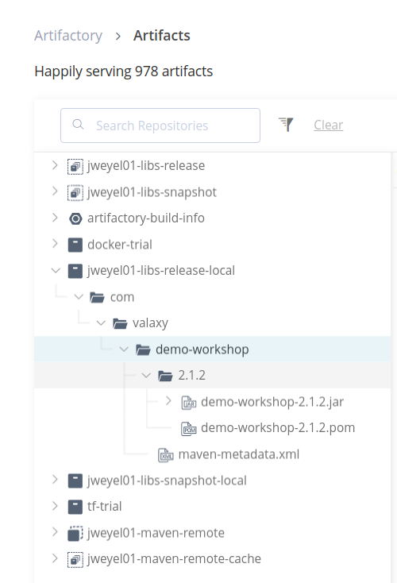

# Secton 7 - JFrog Artifactory integration with Jenkins

## Introduction
To be able to use JFrog Artifactory, some steps have to be taken before it is usable:
1. Create Artifactory account
2. Generate access token with username
3. Add username and password under Jenkins credentials
4. Install the Artifactory plugin
5. Update Jenkinsfile with jar publish stage
6. Create Dockerfile
7. Create and publish docker image on Artifactory


### 1. Create Artifactory account
- Go to https://jfrog.com/
- Create cloud account with 14-day free trial
- Specify `Hostname`, `First Name` and `Last Name`
- Select AWS and AWS-region
- Click `Create your first repository` and choose `Maven`, then set prefix

### 2. Generate access token with username
- Click on `Administration` tab at the top of the page
- Select `User Management` from the sidebar
- Select `Access token` from the dropdown menu
- Click `+ Generate Token` with the following parameters:
  - **Description**: jenkins-access-token
  - **Token scope**: Admin
  - **User name**: your email from login
- On your Jenkins UI go to `[Dashboard]` -> `[Manage Jenkins]` -> `[Credentials]` -> `[System]` -> `[Global credentials (unrestricted)]`, then click `Add Credentials`
  - **Kind**: Username with password
  - **Scope**: Global
  - **Username**: your email from JFrog
  - **Password**: The JFrog token
  - **Description (optional)**: JFrog-Credentials
  
### 4. Install the Artifactory plugin
- Go to `[Dashboard]` -> `[Manage Jenkins]` -> `[Plugins]` -> `[Available plugins]`
- Search for [`Artifactory`](https://plugins.jenkins.io/artifactory) and install


### 5. Update Jenkinsfile with jar publish stage
- Documentation: https://jfrog.com/help/r/jfrog-integrations-documentation/scripted-pipeline-syntax

Collect the relevant information:
```yml
jfrog Artifactory URL: https://joweyel01.jfrog.io/
Artifact location: /home/ubuntu/jenkins/workspace/ttrend-multibranch_main/jarstaging/com/valaxy/demo-workshop/2.1.2
Credentials: artifact-cred
```
- Add the artifactory credentials once again as `artifact-cred`, but this time with ID `artifact-cred`, then remove the previously used credentials for JFrog 

Append the pipeline in the Jenkinsfile by this: 
- replace JFrog **`registry`**-name with your own
- Insert the **`target`** as you have specified when creating the maven artifactory

```groovy
def registry = 'https://joweyel01.jfrog.io'
stage("Jar Publish") 
{
    steps 
    {
        script 
        {
            echo '<--------------- Jar Publish Started --------------->'
            def server = Artifactory.newServer url:registry+"/artifactory" ,  credentialsId:"artifact-cred"
            def properties = "buildid=${env.BUILD_ID},commitid=${GIT_COMMIT}";
            def uploadSpec = """{
            "files": [
                {
                    "pattern": "jarstaging/(*)",
                    "target": "jweyel01-libs-release-local/{1}",
                    "flat": "false",
                    "props" : "${properties}",
                    "exclusions": [ "*.sha1", "*.md5"]
                }
            ]
            }"""
            def buildInfo = server.upload(uploadSpec)
            buildInfo.env.collect()
            server.publishBuildInfo(buildInfo)
            echo '<--------------- Jar Publish Ended --------------->'  
        }
    }   
}   
```
After pushing to GitHub the artifacts will now stored in the JFrog artifactory:



To make the artifacts easier deployable as microservice, the usage of docker container is required. This then allows to deploy the container with kubernetes.
