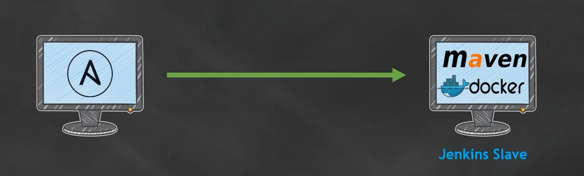

# Section 8 - Docker Integration (in Jenkins)

- Install Docker on jenkins slave system
- Create a Dockerfile
- Create a docker repository in JFrog
- Install `Docker pipeline` plugin in Jenkins
- Update Jenkins file with docker build and publish stage

## Setting up Docker with Ansible




Adding this code to the ansible configuration `json-slave-setup.yaml` on the ansible server to install docker:

```yaml
  - name: install docker
    apt:
      name: docker.io
      state: present
  
  - name: start docker service
    service:
      name: docker
      state: started
  
  - name: give 777 permission on /var/run/docker.sock
    file:
      path: /var/run/docker.sock
      state: file
      mode: 0777

  - name: start dicker at boot time
    service: 
      name: docker
      enabled: yes
```

On the ansible server do the following to install everything on the specified machine:
```bash
sudo su -
cd /opt
ansible-playbook -i hosts jenkins-slave-setup.yaml --check  # dry run
ansible-playbook -i hosts jenkins-slave-setup.yaml          # wet run (for real)
```

On the `maven-slave` call the following commands to see if everything went smoothly:
```bash
service docker status  # check if docker is running
docker --version       # Check the version of docker
```

## Create a Dockerfile for maven-slave
The created Dockerfile has to be put in the source code so that it will appear in the workspace on the `maven-slave` server

```Dockerfile
FROM openjdk:8

COPY jarstaging/com/valaxy/demo-workshop/2.1.2/demo-workshop-2.1.2.jar ttrend.jar
ENTRYPOINT [ "java", "-jar", "ttrend.jar" ]
```

This just gets the Dockerfile to the server in the next build process. To use it, you have to adapt the Jenkinsfile for it.


## Create Docker artifact repository in JFrog Artifactory

- Create docker-repo in JFrog with name: `<some-prefix>-docker` (the prefix is up to you)
- Go to Jenkins and install the `Docker Pipeline` plugin

## Update Jenkinsfile to use Docker

Important stuff for this step:
```groovy
// At the beginning of the Jenkinsfile
def imageName = 'joweyel01.jfrog.io/jweyel-docker-local/ttrend'
def version = '2.1.2'
...
```

```groovy
// At the end of the Jenkinsfile (Pipeline)
...
stage("Docker Build") 
{
    steps 
    {
        script 
        {
        echo '<--------------- Docker Build Started --------------->'
        app = docker.build(imageName+":"+version)
        echo '<--------------- Docker Build Ends --------------->'
        }
    }
}
stage ("Docker Publish")
{
    steps {
        script {
            echo '<--------------- Docker Publish Started --------------->'  
            docker.withRegistry(registry, 'artifact-cred')
            {
                app.push()
            }    
            echo '<--------------- Docker Publish Ended --------------->'  
        }
    }
}
```

Now go to Jenkins and execute the multi-branch pipeline yourself. After completion you should be able to see results like this when calling `docker images` in the console of the jenkins-slave server:
```bash
REPOSITORY                                      TAG       IMAGE ID       CREATED              SIZE
joweyel01.jfrog.io/jweyel-docker-local/ttrend   2.1.2     e0989be8e23b   About a minute ago   545MB
openjdk                                         8         b273004037cc   2 years ago          526MB
```
The docker image is now also on the JFrog Artifact repository you specified in the Jenkins-pipeline.

## Testing the functionality of the Docker image
Run a container from the previously created Docker image
```bash
docker run -dt --name ttrend -p 8000:8000 joweyel01.jfrog.io/jweyel-docker-local/ttrend:2.1.2
```

Calling `docker ps -a` should result in something like this:
```txt
CONTAINER ID   IMAGE                                                 COMMAND                  CREATED          STATUS          PORTS                                       NAMES
02853381ca15   joweyel01.jfrog.io/jweyel-docker-local/ttrend:2.1.2   "java -jar ttrend.jar"   53 seconds ago   Up 51 seconds   0.0.0.0:8000->8000/tcp, :::8000->8000/tcp   ttrend
```

To access the executed program in the docker container, you have to open the mapped port `8000` in the inbound rules of the projects security group (`demo-sg`).

Add the following rule to the *Inbuond rules*:
- **Type**: `Custom TCP`
- **Protocol**: `TCP`
- **Port range**: `8000`
- **Source**: `Anywhere IPv4`, `0.0.0.0/0`
- **Description**: `ttrend docker container access`

Now open the jenkins-slave IP with port `8000` and you will see **`Greetings from Valaxy Technologies`**


The next step to take is, how to deploy the docker container with the program. For this `Kubernetes` will be used in the next section.