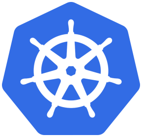

# Section 9 - Deploying with Kubernetes



- Setting up a Kubernetes cluster (EKS) with Terraform
- Create deployment- and service-files
- Create secrets
- Using secrets in the manifest file

## Creating EKS cluster with Terraform

The terraform code that is required for a EKS cluster can be found [here](../terraform_code/eks/).
The main components here are:
- IAM roles
- IAM policies
- EKS cluster
- Node group

In the next step a security group for the EKS cluster is created and can be found [here](../terraform_code/sg_eks/)

In the last step, the terraform [file](../terraform_code/V3-EC2_for_each.tf), that was used to set up everything in previous sections, is updated to use (`eks` and `sg_eks`) as terraform-modules.

```tf
# Security group of EKS cluster
module "sgs" {
  source = "../sg_eks"
  vpc_id = aws_vpc.dpp-vpc.id
}

# EKS cluster
module "eks" {
  source = "../eks"
  vpc_id = aws_vpc.dpp-vpc.id
  subnet_ids = [aws_subnet.dpp-public-subnet-01.id, aws_subnet.dpp-public-subnet-02.id]
  sg_ids = module.sgs.security_group_public
}
```

The file [V3-EC2_for_each.tf](../terraform_code/V3-EC2_for_each.tf) and all auxilary terraform files are moved to folder `vpc` (which has to be created).

## Execute Terraform manifest file to setup the EKS cluster
To get everything up and running, follow the instructions below (assuming pwd is `terraform_code`):
```bash
cd vpc

# Important pre-requisite: explicitly setting AWS IAM user that has appropriate rights (same cred's used on the build-server)
aws configure --profile <name-of-iam-user>  # Example:`terraform` from section 3 has admin access-rights

# (Optional) For those that make it absolutely sure to use the correct credentials
export AWS_ACCESS_KEY_ID=<your-access-key>
export AWS_SECRET_ACCESS_KEY=<your-secret-access-key>
export AWS_PROFILE=<name-of-iam-user>
export AWS_DEFAULT_REGION=<your-region> 

# Re-initialize terraform due to additional models that are used
terraform init

# Check if code is valid terraform code
terraform validate

# There are many components and creation should take 10~15 minutes
terraform plan
terraform apply
```

In summary these are the 17 resources that will be created:
```log
module.eks.aws_eks_cluster.eks
module.eks.aws_eks_node_group.backend
module.eks.aws_iam_instance_profile.worker
module.eks.aws_iam_policy.autoscaler
module.eks.aws_iam_role.master
module.eks.aws_iam_role.worker
module.eks.aws_iam_role_policy_attachment.AmazonEC2ContainerRegistryReadOnly
module.eks.aws_iam_role_policy_attachment.AmazonEKSClusterPolicy
module.eks.aws_iam_role_policy_attachment.AmazonEKSServicePolicy
module.eks.aws_iam_role_policy_attachment.AmazonEKSVPCResourceController
module.eks.aws_iam_role_policy_attachment.AmazonEKSWorkerNodePolicy
module.eks.aws_iam_role_policy_attachment.AmazonEKS_CNI_Policy
module.eks.aws_iam_role_policy_attachment.AmazonSSMManagedInstanceCore
module.eks.aws_iam_role_policy_attachment.autoscaler
module.eks.aws_iam_role_policy_attachment.s3
module.eks.aws_iam_role_policy_attachment.x-ray
module.sgs.aws_security_group.worker_node_sg
```

After the process has finied creating, you will see the following:
- The cluster you created in the AWS web-ui under the `EKS`-sction
- Two `EC2`-instances that represent the **master** and the **worker** from [`eks.tf`](../terraform_code/eks/eks.tf)

## How to terminate the EKS cluster for AWS billing optimization
To remove all EKS related resources, comment out the two added modules `sgs` and `eks` in [V5-eks_setup.tf](../terraform_code/vpc/V5-eks_setup.tf). Whenn calling `terraform plan` and `terraform apply`, you will see that all the 17 previously created resources will be destroyed.

## Integrate build server with Kubernetes cluster
The build server is used for managing the kubernetes cluster and deplying to the kubernetes cluster. For this restart the EKS cluster.

Install `kubectl` on build-server:
```bash
sudo su -
# Replace with the version of your created Kubernetes cluster (in list of EKS cluster in AWS)
RELEASE=v1.30.0
curl -LO "https://dl.k8s.io/release/${RELEASE}/bin/linux/amd64/kubectl"
chmod +x ./kubectl
mv ./kubectl /usr/local/bin
kubectl version
```

Install `awscli2` (required) on build server:
```bash
sudo su -
curl "https://awscli.amazonaws.com/awscli-exe-linux-x86_64.zip" -o "awscliv2.zip"
apt install unzip
unzip awscliv2.zip
./aws/install --update
```

Configure `awscli` to connect to aws account. You can use the `terraform` IAM-keypair:
```bash
aws configure --profile <name-of-iam-user>  # provide access key id, secret acces key, region and format

# (Optional) For those that make it absolutely sure to use the correct credentials
export AWS_ACCESS_KEY_ID=<your-access-key>
export AWS_SECRET_ACCESS_KEY=<your-secret-access-key>
export AWS_PROFILE=<name-of-iam-user>
export AWS_DEFAULT_REGION=<your-region> 

# Testing the connection (IAM)
aws s3 ls
```

Download Kubernetes credentials and cluster config (`.kube/config`) from the cluster:
```bash
aws eks update-kubeconfig --region us-east-1 --name jw-eks-01  # name taken from AWS EKS ui
kubectl get nodes
```

